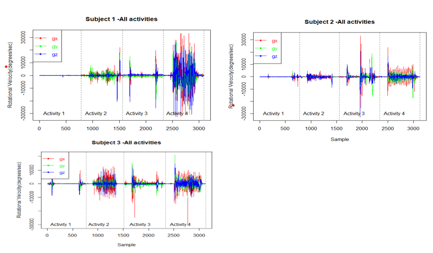

# Human Activity Recognition (Data Collection, Preparation & Analysis)

## Project Description

Human Activity Recognition (HAR) is a research field focused on the identification of specific physical activities performed by individuals using sensor data.HAR has found applications in various domains such as monitoring elderly individuals, designing smart home environments, enhancing human-computer interaction, and developing smart driving assistants.

This study aims to collect sensor data from a group of subjects and store it in a structured manner, enabling further analysis. 

Proficiency in understanding the data capture process and utilizing sensors to collect data is crucial for data scientists, as it facilitates comprehension of the data, identification of potential error sources, and determination of suitable data preparation procedures. The collected data is then prepared and analysed to derive valuable insights. The preparation and analysis of the data have added significant value to our study, enabling informed decision-making and the identification of meaningful patterns and trends.

## Dataset

For the data collection and measurement of various human activities, we utilized the Arduino Uno development board in conjunction with a gyroscope (MPU-6050). The gyroscope provided essential orientation information in the form of x, y, and z coordinates. The Arduino Uno effectively interfaced with the gyroscope, enabling seamless data retrieval from this sensor. The integration of these components facilitated accurate and reliable measurement of human activities for our research purposes.

After getting consent from each subject, they were asked to perform a group of activities while wearing the sensor on the right wrist. The collected datais then saed and analysed. 

## Results

The analysis revealed minimal fluctuations in rotational velocity during periods of idle sitting, which gradually increased when individuals were seated and engaged in computer work. Furthermore, an additional increase in fluctuation was observed when participants were standing and visually exploring their surroundings. The highest level of fluctuations were observed during walking on the spot. These observation indicates that greater levels of movement correspond to increased oscillations in rotational velocity.
 

## Future Works

This study focused on investigating four specific activities with a limited number of subjects. However, for future research, it is recommended to expand the scope by considering a broader range of activities and a larger subject pool. By incorporating additional activities and increasing the sample size, more comprehensive and robust results can be obtained, leading to a better understanding of human activity recognition and improving the overall effectiveness of the analysis.